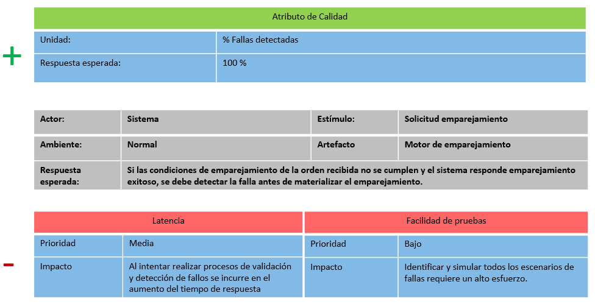
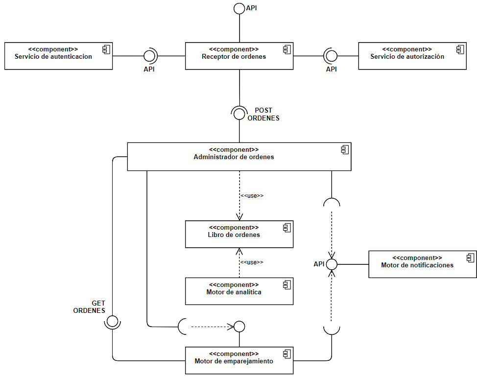
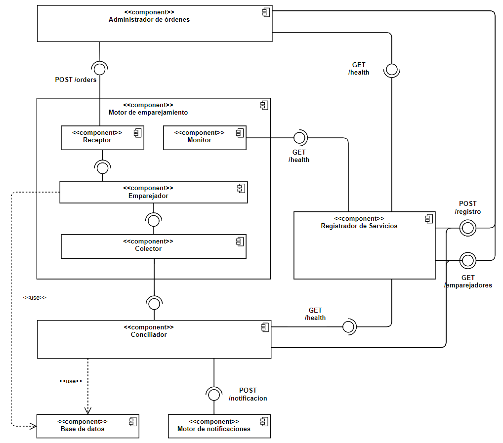
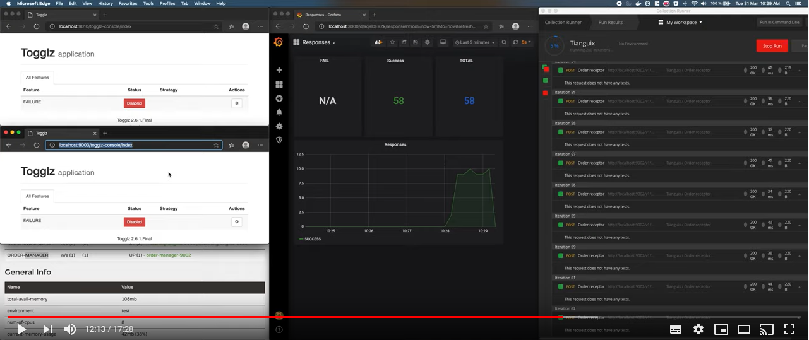

# Arquitectura de Software, Reto 3 (Flexibilidad e Interoperabilidad)

Este repositorio contiene el código fuente del experimento realizado con el fin de comprobar 
el punto crítico asociado a la arquitectura de software que se diseñó para el **Reto 2**, reto asociado
a la disponibilidad de **Tianguix**.

## ASR a satisfacer

A continuación se detalla el ASR que se pretende satisfacer con la arquitectura que se diseñó, con motivo
de dar contexto sobre las motivaciones que nos llevaron a tomar las decisiones de diseño.




## Componente a probar

Como se mencionó en el apartado inmediatamente anterior, el experimento gira en torno al **Motor de Emparejamiento**,
cuya composición interna se detalla en el siguiente diagrama de componentes:



## Descripción del experimento

La ejecución del experimento consistirá en mandarle carga al **Administrador de Órdenes**, quien tendrá que comunicarse con **Eureka** para saber cuantas instancias del **Motor de Emparejamiento**  se están ejecutando, una vez se obtenga el número de instancias, la petición original deberá ser clasificada y reenviada a todas las instancias del **Motor de Emparejamiento**, quien a su vez, tendrá que generar una respuesta y enviársela al **Conciliador**.

El **Conciliador** deberá esperar las respuestas de las instancias del **Motor de Emparejamiento** que estén en ejecución y para saber cuantas respuestas tiene que esperar, tendrá que comunicarse con Eureka. Si no hay consenso en las respuestas recibidas, se tendrá que notificar la falla a Slack.

Una vez estén levantados todos los servicios, se introducirá una falla en el **Motor de Emparejamiento**, la falla será introducida gracias a un **feature flag** que nos permitirá en ejecución cambiar el comportamiento del algoritmo de emparejamiento, con este comportamiento esperamos comprobar la efectividad en la detección de fallas asociadas al proceso de emparejamiento.



## Resultados Esperados

- Detectar el **100%** de la fallas presentadas.

## Evidencia del experimento realizado

La evidencia de la ejecución del experimento se puede ver en el siguiente video:

[](https://youtu.be/rFCCOnK-FDY)

## Tecnologías y frameworks utilizados

- Java 13 como lenguaje de programación
- [InfluxDB](https://grafana.com/) para la implementación del modelo de actores
- [Grafana](https://www.influxdata.com/) para la ejecución de las pruebas de carga
- [Spring Cloud Netflix] (https://spring.io/projects/spring-cloud-netflix) para la creación del registry, clientes rest, y descubriminetos de servicios.
- [Docker](https://www.docker.com/) para ejecutar los servicios de [InfluxDB](https://grafana.com/) y Grafana](https://www.influxdata.com/)

## Ejecución del experimento

Ne primera medida se debe levantar el servicio de [InfluxDB](https://grafana.com/) y [Grafana](https://www.influxdata.com/), para esto debe tener instalado [Docker](https://www.docker.com/products/docker-desktop) y [Docker Compose](https://docs.docker.com/compose/) en la maquina. Una vez se cuente con esto puede ejecutar el siguiente comando para iniciar los servicios:


 ``` console
 foo@bar:~$ cd [PROJECT_FOLDER]/docker 
```

 ``` console
 foo@bar:~$ docker-compose up -d 
```

Donde `PROJECT_FOLDER`es la carpeta raiz de este proyecto.

Para ingresar a la interfaz gráfica se debe seguir el siguiente link: http://localhost:3000/, e ingresar con las credenciales (username/password) **admin/admin** 
